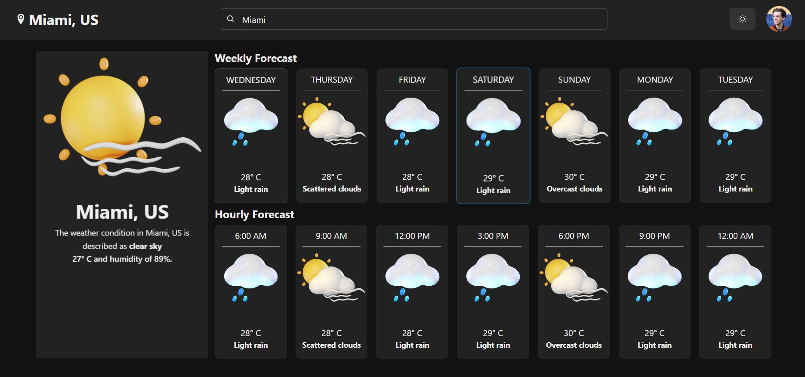
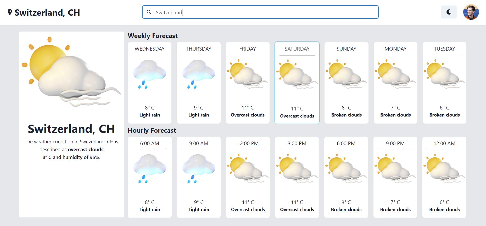

# Weatheria

Weatheria a weather application that keep track of the weather around the world using RapidAPI and NextJS, TypeScript, Redux Toolkit, TailwindCSS, Chakra UI and openweatherAPI.

## Table of contents

- [Screenshot](#screenshot)
- [Links](#links)
- [Built with](#built-with)
- [Author](#author)
- [Acknowledgments](#acknowledgments)

### Screenshot




### Links

- Solution URL: [https://github.com/ErysCode7/weatheria](https://github.com/ErysCode7/weatheria)
- Live Site URL: [https://weatheria-taupe.vercel.app/](https://weatheria-taupe.vercel.app/)

1. Clone the repo

   ```sh
   git clone git@github.com:ErysCode7/weatheria.git
   ```

2. Install NPM packages

   ```sh
   npm install
   ```

3. Run app

   ```sh
   npm start
   ```

### Built with

- [Next.js](https://nextjs.org/) - JS library
- [TypeScript](https://www.typescriptlang.org/) - JavaScript with syntax for types
- [Chakra-UI](https://chakra-ui.com/) - User interface component
- [Redux Toolkit Query](https://redux-toolkit.js.org/rtk-query/overview) - RTK Query is a powerful data fetching and caching tool. It is designed to simplify common cases for loading data in a web application,
- [TailwindCSS](https://tailwindcss.com/) - CSS Framework
- [RapidAPI](https://rapidapi.com/hub) - API Hub

## Author

- Facebook - [Erys Mozo](https://web.facebook.com/erys.mozo/)
- Instagram - [\_erysmozo](https://www.instagram.com/_erysmozo/)
- Frontend Mentor - [ErysCode7](https://www.frontendmentor.io/profile/ErysCode7)
- LinkedIn - [Erys Mozo](https://www.linkedin.com/in/erys-mozo-280190230/)

## Acknowledgments
I acknowledge myself that I can build these amazing things. Hoping to improve and learn better.
